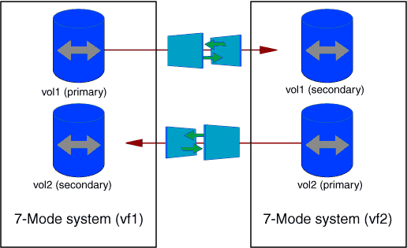

= 프로젝트에서 볼륨을 선택하는 시나리오입니다
:icons: font
:imagesdir: ../media/

[role="lead"]
프로젝트 구성을 계획하고 단일 전환 작업에서 전환할 7-Mode 볼륨을 결정하는 것은 애플리케이션의 다운타임을 줄이는 데 도움이 될 수 있습니다. 일부 예제 시나리오를 이해하면 사용자 환경에서 프로젝트를 만드는 데 도움이 됩니다.

== 양방향 SnapMirror 관계

양방향 SnapMirror 관계를 전환을 위해서는 각 볼륨에 대해 서로 다른 전환 프로젝트를 생성해야 합니다.

예를 들어, 아래 그림과 같이 시스템1의 vF1:vol1(기본)과 시스템2의 vf2:vol1(보조) 사이에 존재하는 볼륨 SnapMirror 관계를 고려하십시오. 마찬가지로, 시스템 2의 vf2:vol2(운영)와 시스템 1의 vF1:vol2(보조) 사이에 또 다른 볼륨 SnapMirror 관계가 있습니다.

하나의 전이 프로젝트에서 볼륨 vF1:vol1과 vF1:vol2를 결합할 수 없습니다. 마찬가지로, 하나의 전환 프로젝트에서 볼륨 vf2:vol1 및 vf2:vol2를 결합할 수 없습니다. 볼륨 SnapMirror 관계를 전환하기 위해 각 볼륨에 대해 별도의 전환 프로젝트를 생성해야 합니다.

== CIFS 구성이 있는 볼륨

모든 CIFS 관련 구성이 SVM으로 완전히 전환되도록 하나의 프로젝트에서 CIFS 구성이 있는 볼륨을 그룹화해야 합니다.

예를 들어, 7-Mode 시스템 또는 vFiler 유닛의 볼륨 10개에 연결된 CIFS 공유, 홈 디렉토리 검색 경로 및 감사 구성이 있는 경우 이러한 10개의 볼륨은 하나의 프로젝트로 전환되어야 합니다. 이렇게 하면 전환 후 SVM에 모든 볼륨 및 CIFS 구성이 완전히 적용됩니다.

== 운영 볼륨과 여러 보조 볼륨 간의 SnapMirror 관계

운영 볼륨과 여러 보조 볼륨 사이에 SnapMirror 관계가 존재하고 모든 보조 볼륨이 동일한 7-Mode 컨트롤러에 있는 경우, 보조 프로젝트를 생성하여 모든 보조 볼륨을 그룹화하고 해당 프로젝트의 모든 보조 볼륨의 전환을 완료할 수 있습니다. 그런 다음 기본 프로젝트를 생성하여 운영 볼륨을 전환하고 SnapMirror 전환을 완료할 수 있습니다.
