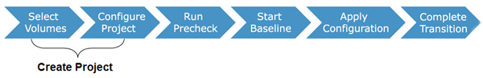

= 7-Mode 볼륨에서 데이터 및 구성 마이그레이션
:allow-uri-read: 
:icons: font
:imagesdir: ../media/

[role="lead"]
7-Mode 전환 툴을 사용하여 볼륨 또는 볼륨 SnapMirror 관계를 마이그레이션하려면 먼저 프로젝트를 구성하고, 기본 복사본을 시작하고, 프로젝트를 완료해야 합니다.

* 전환에 포함하려는 7-Mode 컨트롤러 및 클러스터는 도구가 설치된 Windows 호스트에서 연결할 수 있어야 합니다.
* 전환 프로젝트에 포함할 컨트롤러와 클러스터에 대한 모든 관리자 수준 권한이 있어야 합니다.
* 7-Mode 전환 툴 서비스는 시스템이 설치된 시스템에서 실행 중이어야 합니다.
+
이 서비스는 기본적으로 자동으로 설정되며 컴퓨터를 다시 시작할 때 시작해야 합니다.

* 컨트롤러에서 평가 및 마이그레이션 작업을 동시에 수행하면 안 됩니다.
* 사전 점검을 통해 보고된 오류 및 경고를 해결한 후에는 7-Mode 컨트롤러 및 클러스터의 오브젝트(볼륨, IP 주소, 시스템 정보 등)를 수정하지 마십시오.
* 원치 않는 결과를 방지하려면 동일한 SVM에 동시에 쓰는 여러 웹 인터페이스 세션을 사용하지 않아야 합니다.
* 전환 프로세스 중에 컨트롤러 및 클러스터 암호를 수정하지 마십시오.
* 이 도구는 웹 브라우저 탐색을 지원하지 않으며 원치 않는 결과를 초래할 수 있으므로 ** 뒤로** 및 * 앞으로* 브라우저 버튼을 사용하지 않아야 합니다.
* 전환이 진행 중인 동안에는 원치 않는 결과가 발생할 수 있으므로 브라우저 새로 고침을 피해야 합니다.

다음 그림에서는 마이그레이션 프로세스를 보여 줍니다.

* 관련 정보 *

xref:concept_how_you_transition_a_stand_alone_volume.adoc[독립형 볼륨을 전환하는 방법]

xref:concept_how_you_transition_volumes_in_a_snapmirror_relationship.adoc[SnapMirror 관계에서 볼륨을 전환하는 방법입니다]
