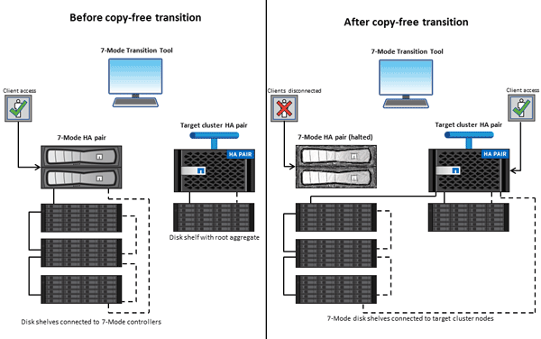

= 7-Mode 전환 툴을 사용하여 무복제 전환
:icons: font
:imagesdir: ../media/

[role="lead"]
7-Mode 전환 툴을 사용하면 인벤토리를 수집하고 7-Mode 컨트롤러, 호스트, 스위치 및 애플리케이션을 평가할 수 있습니다. 평가 후 무복사 전환을 사용하여 데이터 및 구성을 ONTAP로 마이그레이션할 수 있습니다. 무복사 전환의 경우 7-Mode HA 쌍에서 모든 디스크 쉘프를 분리하고 타겟 클러스터의 HA 쌍에 연결합니다.

무복사 전환을 통해 7-Mode 디스크 쉘프를 재사용함으로써 마이그레이션 비용을 크게 줄일 수 있습니다. 데이터 복사가 필요하지 않기 때문에 전체 전환 수행 시간이 더 빠릅니다.

무복사 전환의 단위는 HA 쌍입니다. 모든 디스크 쉘프를 7-Mode HA 쌍에서 타겟 클러스터 노드로 이동해야 합니다.

7-Mode 애그리게이트 및 볼륨의 메타데이터는 7-Mode 전환 툴을 통해 ONTAP 형식으로 변환됩니다. 이 변환에 걸리는 시간은 애그리게이트 및 볼륨의 크기에 따라 달라지지 않습니다. 예를 들어, 10GB 애그리게이트를 ONTAP 형식으로 변환하는 데 걸리는 시간은 100TB 애그리게이트를 변환하는 데 걸리는 시간과 동일합니다.

복사를 사용하지 않는 전환에는 데이터 액세스가 중단됩니다. 그러나 데이터 복사가 필요하지 않기 때문에 데이터 마이그레이션을 수행하는 데 걸린 총 시간이 더 빠릅니다.

다음 그림에서는 7-Mode HA 쌍에서 2노드 클러스터로 복사가 없는 전환 전/후 시나리오를 보여 줍니다.

7-Mode 전환 툴은 Windows 시스템에서 실행되며 전환 작업을 관리하는 데 필요한 웹 인터페이스를 제공합니다.

== ONTAP 시스템, 호스트, 스위치 및 애플리케이션의 수집 및 평가

7-Mode 전환 툴을 사용하여 다음과 같은 수집 및 평가 작업을 수행할 수 있습니다.

* ONTAP 시스템(클러스터의 7-Mode 컨트롤러 및 노드), 호스트, 스위치 및 호스트 애플리케이션에서 인벤토리 정보 수집
* FC 존 계획을 생성하여 SAN FC 전환을 위한 존 구성
* 7-Mode 시스템의 기능 평가 및 전환을 위해 선택한 ONTAP 버전에서 이러한 기능이 작동하는 방식을 파악합니다.

== 7-Mode에서 ONTAP로 데이터 및 구성 이동

복사를 사용하지 않는 전환을 통해 7-Mode 디스크 쉘프를 재사용하여 7-Mode 데이터를 7-Mode에서 ONTAP로 복사합니다. 7-Mode 전환 툴을 사용하여 복사를 수행하지 않는 마이그레이션을 수행할 수 있습니다.

* 7-Mode 컨트롤러 또는 vFiler 유닛을 타겟 SVM에 매핑하고 네임스페이스를 설계하기 위한 전환 계획
* 사전 점검을 실행하여 7-Mode 시스템 및 타겟 클러스터 노드의 전환을 확인합니다.
* 다음과 같은 방법으로 7-Mode 디스크 쉘프를 가져옵니다.
+
** 7-Mode HA 쌍에서 새 클러스터의 새 HA 쌍으로 복제
** 7-Mode HA 쌍에서 기존 클러스터에 있는 새 HA 쌍으로, 데이터를 추가로 제공합니다
** 7-Mode HA 쌍에서 데이터를 제공하는 기존 클러스터에 데이터 애그리게이트가 있는 HA 쌍으로 연결합니다
** 볼륨 SnapMirror 관계의 볼륨이 포함된 HA 쌍과 신규 또는 기존 클러스터의 HA 쌍 간
+
전환 후에는 클러스터 피어 관계를 수동으로 생성해야 하지만, 베이스라인 재조정이 필요하지 않으며 전환 후 SnapMirror 관계를 유지할 수 있습니다.

* 7-Mode 구성을 SVM으로 전환
+
무복사 전환은 NAS 및 SAN 구성의 전환을 지원합니다.

* ONTAP로 전환하지 못할 경우 스토리지 및 구성을 7-Mode로 롤백하는 중입니다.
+
이 툴은 7-Mode로 롤백하는 데 필요한 단계 목록을 생성합니다. 7-Mode 시스템 및 클러스터에서 이러한 롤백 단계를 수동으로 수행해야 합니다.

